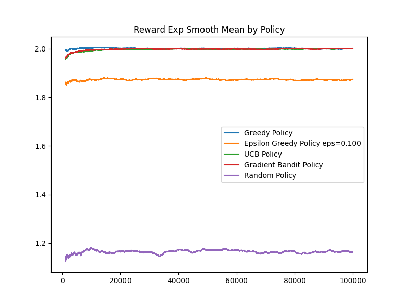

# Comparing Policies

## RL Environment:
Bandit(avg_reward = 1.5, std_reward = 0.1)
Bandit(avg_reward = 2.0, std_reward = 0.2)
Bandit(avg_reward = 0.0, std_reward = 1.0)

Optimal Values: [1.5 2.  0. ]
## Greedy Policy
- Average Reward: 2.001
- Final Q-values: [ 1.399 2.001 0.955 ]
- Action Frequency: 0:1 1:99998 2:1 
## Epsilon Greedy Policy eps=0.100
- Average Reward: 1.875
- Final Q-values: [ 1.500 2.001 0.015 ]
- Action Frequency: 0:4977 1:89926 2:5097 
## UCB Policy(2.0)
- Average Reward: 1.998
- Final Q-values: [ 1.485 1.999 0.185 ]
- Action Frequency: 0:161 1:99825 2:14 
## Gradient Bandit Policy
- Average Reward: 1.999
- Final Q-values: [ 1.501 2.000 -0.097 ]
- Action Frequency: 0:68 1:99911 2:21 
## Random Action Policy
- Average Reward: 1.165
- Final Q-values: [ 1.500 2.002 -0.001 ]
- Action Frequency: 0:33510 1:33114 2:33376 

