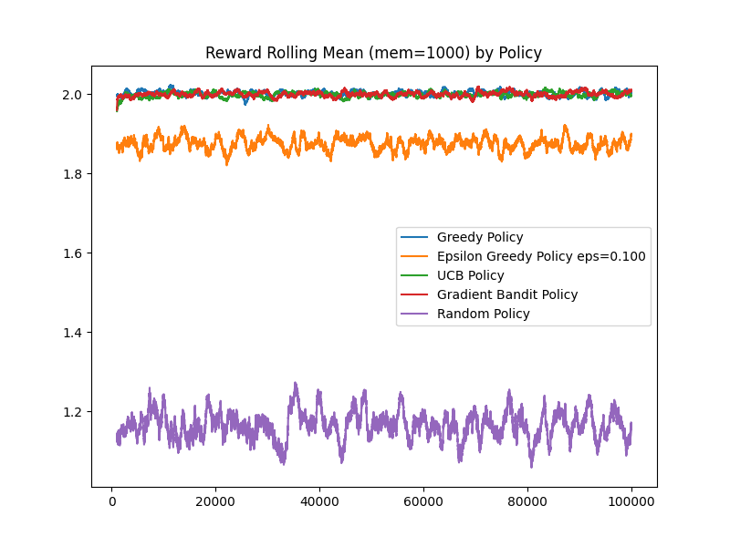

# Comparing Greedy and Eps-Greedy Policies

## RL Environment
- Bandit(avg_reward = 2.0, std_reward = 0.2)
- Bandit(avg_reward = 1.5, std_reward = 0.1)
- Bandit(avg_reward = 0.0, std_reward = 1.0)

Optimal Values: [2.0  1.5  0.0]

## Greedy Policy

- Average Reward: 1.983
- Final Q-values: [2.16 1.14 1.03]
- Action Frequency:
    - 0:   96487
    - 1:    3512
    - 2:       1

## Epsilon Greedy Policy (eps=0.1)
- Average Reward: 1.974
- Final Q-values: [1.64 1.36 1.39]
- Action Frequency
    - 0:   96303
    - 1:    3128
    - 2:     569

