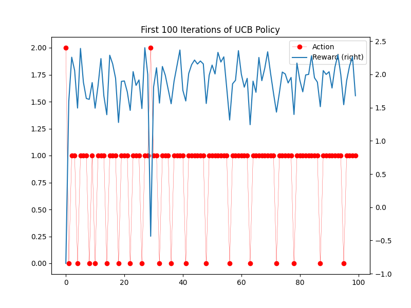

# Comparing Greedy and Eps-Greedy Policies

## RL Environment
- Bandit(avg_reward = 2.0, std_reward = 0.2)
- Bandit(avg_reward = 1.5, std_reward = 0.1)
- Bandit(avg_reward = 0.0, std_reward = 1.0)

Optimal Values: [2.0  1.5  0.0]

## Greedy Policy

- Average Reward: 2.000
- Final Q-values: [ 2.001 1.504 1.997 ]
- Action Frequency: (1, 1) (2, 24) (0, 99975) 

## Epsilon Greedy Policy (eps=0.1)

- Average Reward: 1.987
- Final Q-values: [ 2.001 1.993 -0.135 ]
- Action Frequency: (2, 529) (1, 619) (0, 98852)

## Random Action Policy

- Average Reward: 1.168
- Final Q-values: [ 2.005 1.619 0.170 ]
- Action Frequency: (0, 33169) (2, 33318) (1, 33513) 

